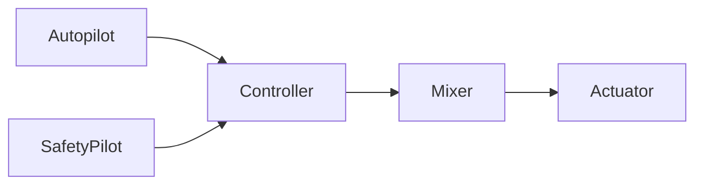

# 机架概览

PX4系统架构采用模块化的设计，可以用一份代码支持多种不同类型的机器人。

## 基本设备

我们假设所有的机架都包括一组基本的硬件配置：

  * 一个Taranis Plus遥控器（或者类似的支持PPM/S.BUS输出的额遥控器）
  * 一个地面站
    * Samsung Note 4或者类似的Android平板
    * iPad（需要Wifi数传适配器）
    * MacBook或者Ubuntu Linux笔记本
  * 一个计算机（用于软件开发）
    * MacBook Pro或者Air，系统版本为OS X 10.10或者更新
    * 安装了Ubuntu Linux（14.04或者更新）的现代笔记本
  * 护目镜
  * 对于多轴飞行器：某些高风险的测试需要系留器材

PX4可以用于各种各样的设备，但是新晋开发者最好使用一种标准配置，Taranis RC plus加一个Note 4平板是不错的平价选择。
