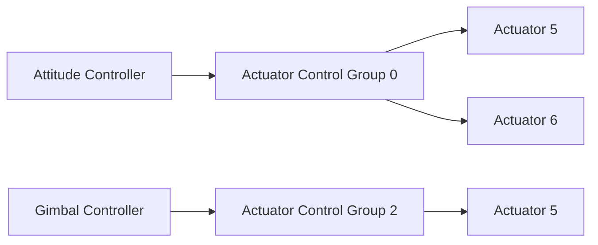

# 混控和执行机构

PX4的架构确保我们不需要为了每种特别的机架布局而修改核心控制器。

混控的含义是将作用力指令（例如“向右转”）翻译为具体控制电机或者伺服器的执行机构执行。对于一架每个副翼都有一个伺服器的固定翼飞行器来说，这意味着将一个副翼转动到高位，将另一个副翼转动到低位。对于多轴飞行器来说，这个含义也是类似的：下俯动作需要改变所有电机的速度。

将混控器逻辑同实际的高度控制器分离极大地提高了可重用性。

## 控制流水线

一个控制器会发送特定的正规化的力（force）或者扭矩（torque）需求（范围从-1到+1）给混控器，混控器随后会依据需求设置各个执行机构。输出驱动（例如，UART、UAVCAN或者PWM）会将米命令翻译为执行机构能够理解的指令，例如，将PWM的值设置为1300。



## 控制群组

PX4定义了控制群组（输入）和输出群组的概念。它们的概念非常简单：控制群组的例子包括用于核心飞行控制的`attitude`或者用于云台控制的`gimbal`；输出群组则对应于物理总线，例如前8个个PWM伺服器通道。每个群组都有8个正规化的（范围从-1到+1）命令端口，这些端口可以被按比例映射到混控器上。混控器定义了这8个控制信号如何映射到8个输出。

对于一个简单的固定翼飞行器来说，控制信号0（滚转）被直接连接到输出0（升降舵）。对于多轴飞行器来说，情况则有些不同：控制信号0（滚转）被连接到所有四个电机，而且会同油门的控制信号融合。

#### 控制群组 #0（Flight Control）

 * 0: roll (-1..1)
 * 1: pitch (-1..1)
 * 2: yaw (-1..1)
 * 3: throttle (0..1 normal range, -1..1 for variable pitch / thrust reversers)
 * 4: flaps (-1..1)
 * 5: spoilers (-1..1)
 * 6: airbrakes (-1..1)
 * 7: landing gear (-1..1)

#### 控制群组 #1（Flight Control VTOL/Alternate）

 * 0: roll ALT (-1..1)
 * 1: pitch ALT (-1..1)
 * 2: yaw ALT (-1..1)
 * 3: throttle ALT (0..1 normal range, -1..1 for variable pitch / thrust reversers)
 * 4: reserved / aux0
 * 5: reserved / aux1
 * 6: reserved / aux2
 * 7: reserved / aux3

#### 控制群组 #2（Gimbal）

 * 0: gimbal roll
 * 1: gimbal pitch
 * 2: gimbal yaw
 * 3: gimbal shutter
 * 4: reserved
 * 5: reserved
 * 6: reserved
 * 7: reserved (parachute, -1..1)

#### 控制群组 #3（Manual Passthrough）

 * 0: RC roll
 * 1: RC pitch
 * 2: RC yaw
 * 3: RC throttle
 * 4: RC mode switch
 * 5: RC aux1
 * 6: RC aux2
 * 7: RC aux3

#### 控制群组 #6（First Payload）

 * 0: function 0 (default: parachute)
 * 1: function 1
 * 2: function 2
 * 3: function 3
 * 4: function 4
 * 5: function 5
 * 6: function 6
 * 7: function 7

### 虚拟控制群组

这些群组**不会**输入到混控器，而会作为元信道，将固定翼飞行器和多轴飞行器控制器的输出传递给VTOL的调速器（governor）模块。

#### 控制群组 #4（Flight Control MC VIRTUAL）

 * 0: roll ALT (-1..1)
 * 1: pitch ALT (-1..1)
 * 2: yaw ALT (-1..1)
 * 3: throttle ALT (0..1 normal range, -1..1 for variable pitch / thrust reversers)
 * 4: reserved / aux0
 * 5: reserved / aux1
 * 6: reserved / aux2
 * 7: reserved / aux3

#### 控制群组 #5（Flight Control FW VIRTUAL）

 * 0: roll ALT (-1..1)
 * 1: pitch ALT (-1..1)
 * 2: yaw ALT (-1..1)
 * 3: throttle ALT (0..1 normal range, -1..1 for variable pitch / thrust reversers)
 * 4: reserved / aux0
 * 5: reserved / aux1
 * 6: reserved / aux2
 * 7: reserved / aux3

## 映射

由于控制群组和输出群组都有许多个，所以一个控制群组可以给多个输出群组发送命令。

```{mermaid id:"j03cnd1s"}
graph TD;
  actuator_group_0-->output_group_5
  actuator_group_0-->output_group_6
  actuator_group_1-->output_group_0
```

## PX4混控器定义

`ROMFS/px4fmu_common/mixers`目录中的文件实现了用于预定义机架的混控器。你可以以它们为基础编写自己的混控器，或者用它们做通用测试。

### 语法

混控器以文本文件形式定义；lines beginning with a single capital letter
followed by a colon are significant. All other lines are ignored, meaning that
explanatory text can be freely mixed with the definitions.

Each file may define more than one mixer; the allocation of mixers to actuators
is specific to the device reading the mixer definition, and the number of
actuator outputs generated by a mixer is specific to the mixer.

For example: each simple or null mixer is assigned to outputs 1 to x
in the order they appear in the mixer file.

A mixer begins with a line of the form

	<tag>: <mixer arguments>

The tag selects the mixer type; 'M' for a simple summing mixer, 'R' for a
multirotor mixer, etc.

#### Null混控器 ####

A null mixer consumes no controls and generates a single actuator output whose
value is always zero.  Typically a null mixer is used as a placeholder in a
collection of mixers in order to achieve a specific pattern of actuator outputs.

The null mixer definition has the form:

	Z:

#### 简单混控器 ####

A simple mixer combines zero or more control inputs into a single actuator
output. Inputs are scaled, and the mixing function sums the result before
applying an output scaler.

A simple mixer definition begins with:

	M: <control count>
	O: <-ve scale> <+ve scale> <offset> <lower limit> <upper limit>

If `<control count>` is zero, the sum is effectively zero and the mixer will
output a fixed value that is `<offset>` constrained by `<lower limit>`
and `<upper limit>`.

The second line defines the output scaler with scaler parameters as discussed
above. Whilst the calculations are performed as floating-point operations, the
values stored in the definition file are scaled by a factor of 10000; i.e. an
offset of -0.5 is encoded as -5000.

The definition continues with `<control count>` entries describing the control
inputs and their scaling, in the form:

	S: <group> <index> <-ve scale> <+ve scale> <offset> <lower limit> <upper limit>

The `<group>` value identifies the control group from which the scaler will read,
and the `<index>` value an offset within that group.  These values are specific to
the device reading the mixer definition.

When used to mix vehicle controls, mixer group zero is the vehicle attitude
control group, and index values zero through three are normally roll, pitch,
yaw and thrust respectively.

The remaining fields on the line configure the control scaler with parameters as
discussed above. Whilst the calculations are performed as floating-point
operations, the values stored in the definition file are scaled by a factor of
10000; i.e. an offset of -0.5 is encoded as -5000.

#### 多轴混控器 ####

The multirotor mixer combines four control inputs (roll, pitch, yaw, thrust)
into a set of actuator outputs intended to drive motor speed controllers.

The mixer definition is a single line of the form:

	R: <geometry> <roll scale> <pitch scale> <yaw scale> <deadband>

支持的机架形式包括：

 * 4x - quadrotor in X configuration
 * 4+ - quadrotor in + configuration
 * 6x - hexacopter in X configuration
 * 6+ - hexacopter in + configuration
 * 8x - octocopter in X configuration
 * 8+ - octocopter in + configuration

Each of the roll, pitch and yaw scale values determine scaling of the roll,
pitch and yaw controls relative to the thrust control.  Whilst the calculations
are performed as floating-point operations, the values stored in the definition
file are scaled by a factor of 10000; i.e. an factor of 0.5 is encoded as 5000.

Roll, pitch and yaw inputs are expected to range from -1.0 to 1.0, whilst the
thrust input ranges from 0.0 to 1.0.  Output for each actuator is in the
range -1.0 to 1.0.

In the case where an actuator saturates, all actuator values are rescaled so that
the saturating actuator is limited to 1.0.
