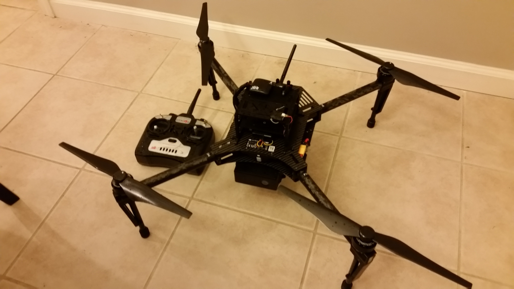

# Matrice 100

https://www.youtube.com/watch?v=3OGs0ONemGc

## 部件列表

  * [DJI Matrice 100](http://store.dji.com/product/matrice-100) 只有ESC、电机和机架。

## 电机连接方式

| 输出 | 频率 | 执行机构 |
| -- | -- | -- |
| MAIN1 | 400 Hz | 右前电机，CCW |
| MAIN2 | 400 Hz | 左后电机，CCW |
| MAIN3 | 400 Hz | 左前电机，CW |
| MAIN4 | 400 Hz | 右后电机，CW |
| AUX1 | 50 Hz | RC AUX1 |
| AUX2 | 50 Hz | RC AUX2 |
| AUX3 | 50 Hz | RC AUX3 |

## 参数

* 如果采用默认的X型四轴增益，在高油门时内环会引发震荡。但是在低油门时，更高的增益值可以提供更好的响应能力。综合前面两点，我们应该针对油门调节不同的增益参数，你可以通过mc_att_control里完整这个任务。不过目前，我们只是调节一下参数，使得无论油门高低，都不会引发震荡。
	* MC_PITCHRATE_P: 0.05
	* MC_PITCHRATE_D: 0.001
* 电池是6S的，默认是3，改掉
	* BAT_N_CELLS: 6
