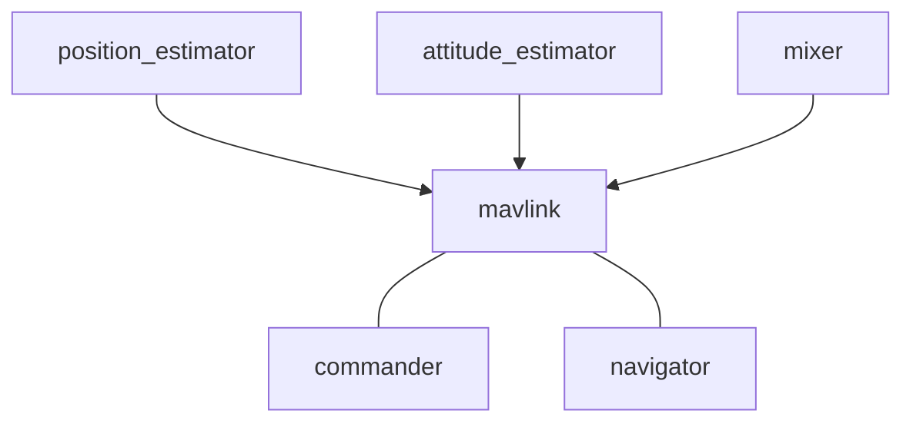

# 架构概览

PX4有两个主要的层次组成：[PX4飞行软件栈](../concept/flight_stack.md) - 一个自动驾驶仪软件解决方案；[PX4中间件](../concept/middleware.md) - 一个通用的机器人中间件，可以支持任意类型的自主机器人。

所有的[机架](../airframes/architecture.md)，甚至所有的机器人系统，如船，都共享同一份代码。整个系统采用[响应式](http://www.reactivemanifesto.org)设计，这意味着：
  * 所有的功能都被划分为可替换的组件
  * 通过异步消息传递通信
  * 系统可以支撑各种各样的负载

除了这些运行时的考虑，模块化还大大提高了[重用性](https://en.wikipedia.org/wiki/Reusability)。

## 高层软件架构

下面每一个方框代表一个独立的模块，每一个箭头表示通过[uORB](../middleware/uorb.md)的publish/subscribe调用实现的连接。

> **信息** PX4的架构允许你非常方便地替换每一个模块，甚至可以在运行时实现这一替换。

每个控制器/混控器都针对特定类型的机架（例如，多轴飞行器、VTOL飞行器或者固定翼飞行器），但是高层的任务管理模块如`commander`和`navigator`在各个平台之间通用。

> **信息**
> 这幅流程图的最新版本在[这里](https://drive.google.com/file/d/0Byq0TIV9P8jfbVVZOVZ0YzhqYWs/view?usp=sharing)，可以使用draw.io打开它。

## 地面站通讯架构

同地面站的交流由所谓的“业务逻辑”应用来处理，包括`commander`（通用命令和控制处理，例如，arming）、`navigator`（将任务转换为低层的导航指令）和`mavlink`（接收MAVLink包并将它们转换为uORB数据结构）应用。这种架构上的隔离避免了在系统内部引入对MAVLink的依赖。MAVLink应用还会接收很多传感器数据和状态估计信息，并将它们发送给地面站。

