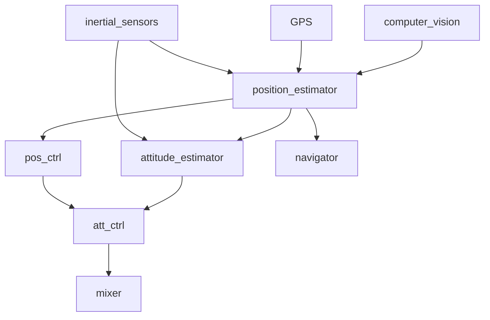

# PX4飞行软件栈

PX4飞行软件栈由一组用于自主飞行器的驾驶、导航和控制算法组成。它包含用于固定翼飞行器、多轴飞行器及VTOL机架的控制器，还包括高度和位置的估计器。

## 估计和控制架构

下图给出了模块的典型框图。依据具体的设备不同，多个模块可能会被合并为一个应用（例如，如果你需要为某个特定的模型写一个单独的模型预测控制器）。

```mermaid
graph TD;
  pos_ctrl-->att_ctrl;
  att_ctrl-->mixer;
  inertial_sensors-->attitude_estimator;
  inertial_sensors-->position_estimator;
  GPS-->position_estimator;
  computer_vision-->position_estimator;
  position_estimator-->navigator;
  position_estimator-->attitude_estimator;
  position_estimator-->pos_ctrl;
  attitude_estimator-->att_ctrl;
```
