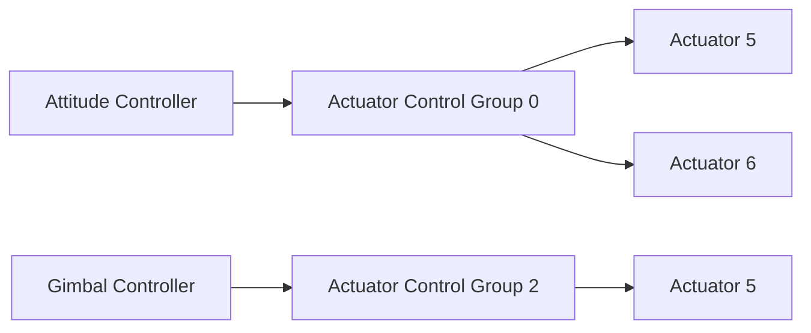
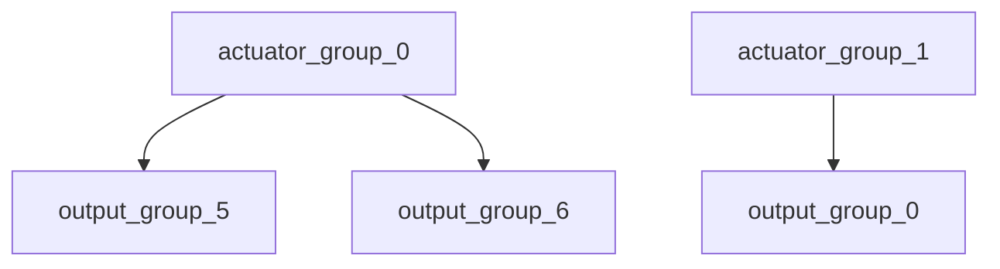

# 混控和执行机构

PX4的架构能够在不修改核心控制器的情况下支持不同类型的机架布局。

混控的含义是将作用力指令（例如“向右转”）翻译为具体控制电机或者伺服器的执行机构指令。对于一架每个副翼都有一个伺服器的固定翼飞行器来说，这意味着将一个副翼转动到高位，将另一个副翼转动到低位。对于多轴飞行器来说，这个含义也是类似的：下俯动作需要改变所有电机的速度。

将混控器逻辑同实际的姿态控制器分离极大地提高了可重用性。

## 控制流水线

一个控制器会发送特定的规范化（范围从-1到+1）的力（force）或者扭矩（torque）需求给混控器，混控器随后会依据需求设置各个执行机构。输出驱动（例如，UART、UAVCAN或者PWM）会将命令翻译为执行机构能够理解的指令，例如，将PWM的值设置为1300。



## 控制群组

PX4定义了控制（输入）群组和输出群组的概念。它们的概念非常简单：控制群组的例子包括用于核心飞行控制的`attitude`或者用于云台控制的`gimbal`；一个输出群组则对应于一条物理总线，例如前8个PWM伺服器通道。每个群组都有8个规范化的（范围从-1到+1）命令端口，这些端口可以被按比例映射到混控器上。混控器定义了这8个控制信号如何映射到8个输出。

对于一个简单的固定翼飞行器来说，控制信号0（滚转）被直接连接到输出0（升降舵）。对于多轴飞行器来说，情况则有些不同：控制信号0（滚转）被连接到所有四个电机，而且会同油门的控制信号融合。

#### 控制群组 #0（Flight Control）

 * 0: roll (-1..1 滚转)
 * 1: pitch (-1..1 俯仰)
 * 2: yaw (-1..1 偏航)
 * 3: throttle (0..1用于常规油门区间，-1..1用于他通过变距螺旋桨或者矢量推进支持反推力的系统)
 * 4: flaps (-1..1 襟翼)
 * 5: spoilers (-1..1 扰流板)
 * 6: airbrakes (-1..1 减速板)
 * 7: landing gear (-1..1 起落架)

#### 控制群组 #1（Flight Control VTOL/Alternate）

 * 0: roll ALT (-1..1 滚转)
 * 1: pitch ALT (-1..1 俯仰)
 * 2: yaw ALT (-1..1 偏航)
 * 3: throttle ALT (0..1用于常规油门区间，-1..1用于他通过变距螺旋桨或者矢量推进支持反推力的系统)
 * 4: reserved / aux0
 * 5: reserved / aux1
 * 6: reserved / aux2
 * 7: reserved / aux3

#### 控制群组 #2（Gimbal）

 * 0: gimbal roll （云台滚转）
 * 1: gimbal pitch （云台俯仰）
 * 2: gimbal yaw （云台偏航）
 * 3: gimbal shutter （云台快门）
 * 4: reserved
 * 5: reserved
 * 6: reserved
 * 7: reserved (降落伞, -1..1)

#### 控制群组 #3（Manual Passthrough）

 * 0: RC roll
 * 1: RC pitch
 * 2: RC yaw
 * 3: RC throttle
 * 4: RC mode switch
 * 5: RC aux1
 * 6: RC aux2
 * 7: RC aux3

#### 控制群组 #6（First Payload）

 * 0: function 0 (default: 降落伞)
 * 1: function 1
 * 2: function 2
 * 3: function 3
 * 4: function 4
 * 5: function 5
 * 6: function 6
 * 7: function 7

### 虚拟控制群组

这些群组 **不会** 输入到混控器，而会作为元信道，将固定翼飞行器和多轴飞行器控制器的输出传递给VTOL的协调器（governor）模块。

#### 控制群组 #4（Flight Control MC VIRTUAL）

 * 0: roll ALT (-1..1)
 * 1: pitch ALT (-1..1)
 * 2: yaw ALT (-1..1)
 * 3: throttle ALT (0..1用于常规油门区间，-1..1用于他通过变距螺旋桨或者矢量推进支持反推力的系统)
 * 4: reserved / aux0
 * 5: reserved / aux1
 * 6: reserved / aux2
 * 7: reserved / aux3

#### 控制群组 #5（Flight Control FW VIRTUAL）

 * 0: roll ALT (-1..1)
 * 1: pitch ALT (-1..1)
 * 2: yaw ALT (-1..1)
 * 3: throttle ALT (0..1用于常规油门区间，-1..1用于他通过变距螺旋桨或者矢量推进支持反推力的系统)
 * 4: reserved / aux0
 * 5: reserved / aux1
 * 6: reserved / aux2
 * 7: reserved / aux3

## 映射

由于控制群组和输出群组都有许多个，所以一个控制群组可以给多个输出群组发送命令。



## PX4混控器定义

`ROMFS/px4fmu_common/mixers`目录中的文件实现了用于预定义机架的混控器。你可以以它们为基础编写自己的混控器，或者用它们做普通测试。

### 语法

混控器以文本文件形式定义，其中以单个大写字母开头，并且随后紧跟着一个分号的行，是有意义的行，所有其他的行都会被忽略，这意味着你可以尽情的书写注释内容。

每个文件可以定义一个或者多个混控器。从混控器到执行机构的映射由读取混控器定义的设备相关的代码所决定；具体输出到每个执行机构的值由混控器代码决定。

例如，每个文件中定义的简单或者null混控器会按照它们在文件中出现的顺序映射到1号到x号输出。

混控器的定义以如下的形式开头：

```
<tag>: <mixer arguments>
```

`tag`指定了混控器的类型；`M`表示一个简单的求和混控器（summing mixer），`R`表示一个多轴混控器，等等。

#### Null混控器 ####

null混控器并不消耗控制输入，但是会生成一个永远为0的输出值给执行机构。null混控器的典型行为是在一组混控器中作为占位符，用于生成特定模式的输出。

null混控器的行为如下：

```
Z:
```

#### 简单混控器 ####

一个简单混控器将0个多个控制输出组合起来，生成单独一个输出给执行机构。输入会被等比缩放，混合函数会把结果加起来，然后应用到输出缩放器上。

一个简单混控器的定义以下面的格式开始：

```
M: <control count>
O: <-ve scale> <+ve scale> <offset> <lower limit> <upper limit>
```

如果`<control count>`是0，the sum is effectively zero and the mixer will
output a fixed value that is `<offset>` constrained by `<lower limit>`
and `<upper limit>`.

The second line defines the output scaler with scaler parameters as discussed
above. Whilst the calculations are performed as floating-point operations, the
values stored in the definition file are scaled by a factor of 10000; i.e. an
offset of -0.5 is encoded as -5000.

The definition continues with `<control count>` entries describing the control
inputs and their scaling, in the form:

	S: <group> <index> <-ve scale> <+ve scale> <offset> <lower limit> <upper limit>

The `<group>` value identifies the control group from which the scaler will read,
and the `<index>` value an offset within that group.  These values are specific to
the device reading the mixer definition.

When used to mix vehicle controls, mixer group zero is the vehicle attitude
control group, and index values zero through three are normally roll, pitch,
yaw and thrust respectively.

The remaining fields on the line configure the control scaler with parameters as
discussed above. Whilst the calculations are performed as floating-point
operations, the values stored in the definition file are scaled by a factor of
10000; i.e. an offset of -0.5 is encoded as -5000.

#### 多轴混控器 ####

The multirotor mixer combines four control inputs (roll, pitch, yaw, thrust)
into a set of actuator outputs intended to drive motor speed controllers.

The mixer definition is a single line of the form:

	R: <geometry> <roll scale> <pitch scale> <yaw scale> <deadband>

支持的机架形式包括：

 * 4x - quadrotor in X configuration
 * 4+ - quadrotor in + configuration
 * 6x - hexacopter in X configuration
 * 6+ - hexacopter in + configuration
 * 8x - octocopter in X configuration
 * 8+ - octocopter in + configuration

Each of the roll, pitch and yaw scale values determine scaling of the roll,
pitch and yaw controls relative to the thrust control.  Whilst the calculations
are performed as floating-point operations, the values stored in the definition
file are scaled by a factor of 10000; i.e. an factor of 0.5 is encoded as 5000.

Roll, pitch and yaw inputs are expected to range from -1.0 to 1.0, whilst the
thrust input ranges from 0.0 to 1.0.  Output for each actuator is in the
range -1.0 to 1.0.

In the case where an actuator saturates, all actuator values are rescaled so that
the saturating actuator is limited to 1.0.
