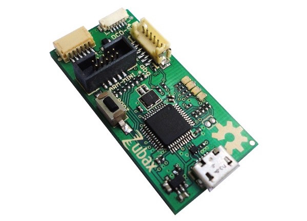

# PX4系统控制台

可以使用系统控制台访问系统的底层接口、调试输出或者分析系统的引导过程。连接系统控制台的最简单方法是使用[Dronecode probe](http://nicadrone.com/index.php?id_product=65&controller=product)，不过普通的FTDI线也能用。

## 系统控制台同Shell的区别

PX4有多个shell，但是只有一个控制台：系统控制台是所有引导信息（包括在引导时自动启动的应用程序的信息）输出的地方。

  * 系统控制台（第一个shell）：硬件串口
  * 其他的shell：Pixhawk on USB（也就是Mac系统里的`/dev/tty.usbmodem1`设备）

> **信息**
> USB shell：如果只需要运行几个命令，或者测试一个应用程序，那么连接到USB shell是很方便的。Mavlink shell也可以用于这一目的，请见下面的介绍。
> 只有在调试启动阶段或者USB需要用作MAVLink时（例如连接[地面站](../qgc/README.md)），才必须要使用硬件串口控制台。

## Snapdragon Flight：控制台连线

开发者套装会附带一个breakout board，其中有三个引脚用于连接控制台。将附带的FTDI线缆连接到插头，并将breakout board连接到扩展接头。

## Pixracer/Pixhawk v3：控制台连线

连接JST SH 6pin 1:1线缆到Dronecode probe，或者将FTDI线缆的每个pin按下图连接：

| Pixracer / Pixhawk v3  |         | FTDI    |        |
| -- | -- | -- | -- |
|1         | +5V (red)     |         | N/C    |
|2         | UART7 Tx      | 5       | FTDI RX (yellow)  |
|3         | UART7 Rx      | 4       | FTDI TX (orange)  |
|4         | SWDIO      |         | N/C   |
|5         | SWCLK      |         | N/C   |
|6         | GND     | 1       | FTDI GND (black)   |

## Pixhawk v1：控制台连线

系统控制台可以通过Dronecode probe或者FTDI线缆访问，我们会在后面分别介绍这两种方式。

### 使用Dronecode Probe连接

将[Dronecode probe](http://nicadrone.com/index.php?id_product=65&controller=product)的6pin DF13 1:1线缆连接到Pixhawk的SERIAL4/5端口。



### 使用FTDI 3.3V线缆连接

如果手头没有Dronecode probe，那么一根FTDI 3.3V线（Digi-Key: [768-1015-ND](http://www.digikey.com/product-detail/en/TTL-232R-3V3/768-1015-ND/1836393)）也行。

| Pixhawk 1/2  |         | FTDI    |        |
| -- | -- | -- | -- |
|1         | +5V (red)     |         | N/C    |
|2         | S4 Tx      |         | N/C   |
|3         | S4 Rx      |         | N/C   |
|4         | S5 Tx      | 5       | FTDI RX (yellow)   |
|5         | S5 Rx      | 4       | FTDI TX (orange)   |
|6         | GND     | 1       | FTDI GND (black)   |

连接器的引脚请看下图。


The complete wiring is shown below.


## 打开控制台

在连好控制台的物理连线后，你可以选用自己喜欢的串口工具，下面我们列出各个系统常见的工具：

### Linux/Mac OS：Screen

在Ubuntu上安装screen软件包（Mac OS已经内置了）：

<div class="host-code"></div>

```bash
sudo apt-get install screen
```

  * 串口：Pixhawk v1/Pixracer使用57600波特率
  * 串口：Snapdragon Flight使用115200波特率

Connect screen at BAUDRATE baud, 8 data bits, 1 stop bit to the right serial port (use `ls /dev/tty*` and watch what changes when unplugging / replugging the USB device). Common names are `/dev/ttyUSB0` and `/dev/ttyACM0` for Linux and `/dev/tty.usbserial-ABCBD` for Mac OS.

<div class="host-code"></div>

```bash
screen /dev/ttyXXX BAUDRATE 8N1
```

### Windows：PuTTY

下载[PuTTY](http://www.chiark.greenend.org.uk/~sgtatham/putty/download.html)并启动。

Then select 'serial connection' and set the port parameters to:

  * 57600 baud
  * 8 data bits
  * 1 stop bit

## 控制台入门

输入`ls`可以查看本地的文件系统，输入`free`可以查看剩余的内存数量。The console will also display the system boot log when power-cycling the board.

```bash
nsh> ls
nsh> free
```

## MAVLink Shell

对于基于NuttX的系统（Pixhawk、Pixracer等），也可以通过mavlink连接到nsh控制台。这个机制适用于串口连接或者WiFi（UDP/TCP）连接。请首先确保QGC没有运行，然后通过命令`./Tools/mavlink_shell.py /dev/ttyACM0`（在Firmware里可以找到）连接。`-h`选项可以列出所有可用参数的描述。你可以用`sudo pip install pymavlink pyserial`命令安装所有依赖关系。

# Snapdragon DSP控制台

When you are connected to your Snapdragon board via usb you have access to the px4 shell on the posix side of things.
The interaction with the DSP side (QuRT) is enabled with the `qshell` posix app and its QuRT companion.

With the Snapdragon connected via USB, open the mini-dm to see the output of the DSP:
```
${HEXAGON_SDK_ROOT}/tools/debug/mini-dm/Linux_Debug/mini-dm
```

Note: Alternatively, especially on Mac, you can also use [nano-dm](https://github.com/kevinmehall/nano-dm).

Run the main app on the linaro side:
```
cd /home/linaro
./px4 px4.config
```

You can now use all apps loaded on the DSP from the linaro shell with the following syntax:
```
pxh> qshell command [args ...]
```

For example, to see the available QuRT apps:
```
pxh> qshell list_tasks
```

The output of the executed command is displayed on the minidm.
