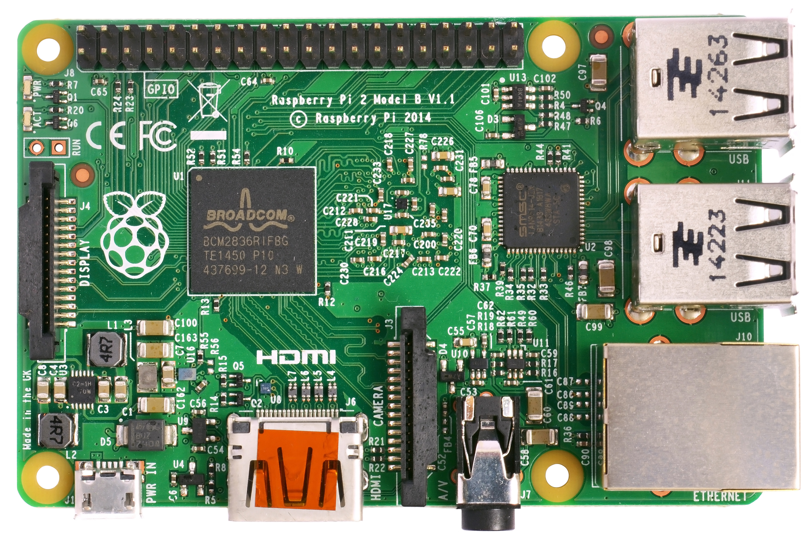

# Raspberry Pi 2/3自动驾驶仪



## 开发者快速上手

### OS映像

使用[Emlid RT Raspbian image for Navio 2](https://docs.emlid.com/navio2/Navio-APM/configuring-raspberry-pi/)。这个默认的映像会集成下面面提到的绝大部分设置工作。

**重要**：请不要升级系统（尤其是不要升级内核）。如果你升级了内核，新的内核通常会缺少必要的硬件支持（你可以通过`ls /sys/class/pwm`命令验证，正常情况下这个目录不应该是空的）。

### 设置访问方法

Raspbian映像内置了SSH支持。用户名是`pi`，密码是`raspberry`。你可以通过网络（以太网默认支持DHCP）连接RPi 2/3并继续配置Wi-Fi访问。在本教程中，我们会假设用户名和密码都没有变过。

请参考[这份文档](https://www.raspberrypi.org/documentation/configuration/wireless/wireless-cli.md)将你的RPi 2/3接入你的本地Wi-Fi网络。

通过你的网络工具（例如路由器管理页面或者snmp工具）获得你的RPi的IP地址，然后通过SSH连接RPi：

<div class="host-code"></div>

```sh
ssh pi@<IP-ADDRESS>
```

### 扩展文件系统

在安装系统后，请连接上去并[扩展文件系统](https://www.raspberrypi.org/documentation/configuration/raspi-config.md)，保证有足够的空间供系统使用。

### 修改主机名

为了避免同网络上的其他RPi冲突，请将你的主机名修改为唯一的值。我们在这里使用`px4autopilot`。通过SSH连接到RPi然后输入下面的命令。

编辑`hostname`文件：

```sh
sudo nano /etc/hostname
```

将文件里的```raspberry```替换为你自己的主机名。

接下来你需要修改`hosts`文件：

```sh
sudo nano /etc/hosts
```

将文件里的```127.0.1.1 raspberry```修改为```127.0.1.1 <YOURNEWHOSTNAME>```。

重启RPi并重新连接到网络。

### 设置Avahi（Zeroconf）

为了能够更为轻松地连接RPi，我们推荐设置Avahi（Zeroconf）服务，通过它你可以直接通过RPi的主机名来访问它。

```sh
sudo apt-get install avahi-daemon
sudo insserv avahi-daemon
```
接下来修改Avahi的配置文件：

```sh
sudo nano /etc/avahi/services/multiple.service
```

将下面内容添加到文件里：

```xml
<?xml version="1.0" standalone='no'?>
<!DOCTYPE service-group SYSTEM "avahi-service.dtd">
<service-group>
        <name replace-wildcards="yes">%h</name>
        <service>
                <type>_device-info._tcp</type>
                <port>0</port>
                <txt-record>model=RackMac</txt-record>
        </service>
        <service>
                <type>_ssh._tcp</type>
                <port>22</port>
        </service>
</service-group>

```

重新启动这个守护程序。

```sh
sudo /etc/init.d/avahi-daemon restart
```

这就行了。以后你应该可以通过主机名直接登录你的RPi了。

> **Tip** 你可能需要将`.local`添加到`hostname`文件里，否则可能无法通过域名解析。

### 配置SSH公钥

PX4开发环境需要将可执行文件推送到RPi上去执行，如果你想要能够自动化执行这些动作，需要将RPi配置为可以通过无密码方式访问。我们使用公钥认证的方式实现这一目的。

首先，在开发机上使用下面的命令生成新的SSH秘钥（请选择一个有意义的名字，例如```<YOURNANME>@<YOURDEVICE>```，这里我们选择```pi@px4autopilot```）：

<div class="host-code"></div>

```sh
ssh-keygen -t rsa -C pi@px4autopilot
```

这个命令会询问你将秘钥保存到哪里。我们建议你将其保存到默认的位置（`$HOME/.ssh/id_rsa`），你只需要按下`Enter`就行。

现在你可以在```.ssh```目录里见到```id_rsa```和```id_rsa.pub```文件：

<div class="host-code"></div>

```sh
ls ~/.ssh
authorized_keys  id_rsa  id_rsa.pub  known_hosts
```

```id_rsa```文件是你的私钥。请将这个保存在开发机上。```id_rsa.pub```文件是你的公钥。你需要将这个文件放到你想访问的RPi上。

使用如下命令通过SSH将公钥文件拷贝到你的RPi的authorized_keys文件上：

<div class="host-code"></div>

```sh
cat ~/.ssh/id_rsa.pub | ssh pi@px4autopilot 'cat >> .ssh/authorized_keys'
```

注意，在这个命令里你必须要输入你的密码（默认密码是`raspberry`）。

现在试着执行```ssh pi@px4autopilot```命令登录RPi，你应该可以不用密码就能登陆。

如果你遇到错误消息```Agent admitted failure to sign using the key.```，那么请将你的RSA或者DSA身份添加到认证代理（ssh-agent）中，执行：

<div class="host-code"></div>

```sh
ssh-add
```

如果上面的命令无效，请删除你的```rm ~/.ssh/id*```文件然后重新执行上面的各个命令。

### 测试文件传输功能

我们使用SCP将文件通过网络（Wi-Fi或者以太网）从开发机拷贝到目标机。

如果要验证SCP是否可用，请试着通过网络从开发机推送文件到RPi。首先请确保RPi可以访问网络，而且你可以通过SSH连接到它。

<div class="host-code"></div>

```sh
echo "Hello" > hello.txt
scp hello.txt pi@px4autopilot:/home/pi/
rm hello.txt
```

上面的命令会将一个名为`hello.txt`的文件复制到RPi的主目录。请在RPi上验证这个文件确实被复制成功。

### 本地构建（可选）

你也可以直接在RPi上构建PX4。这种构建方式被称为*本地*构建。另一种构建方式是在开发机上交叉编译，然后将得到的二进制文件推送到RPi。这种构建方式被称作*交叉*构建，这种方式比较简单也比较快，是我们推荐的方式。如果你选择使用交叉构建方式，那么可以跳过这一节不看。

下面的脚本会自动在RPi上设置本地构建系统，请在RPi上执行这些命令：

```sh
sudo apt-get update
sudo apt-get install cmake python-empy
```

然后请在RPi上克隆Firmware的源码。

请继续阅读[Linux开发环境](../setup/dev_env_linux.md)一节。
