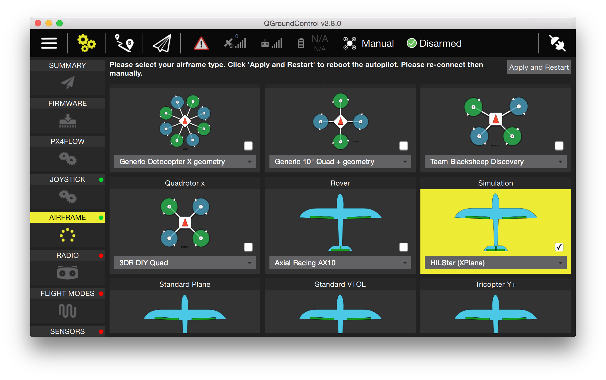
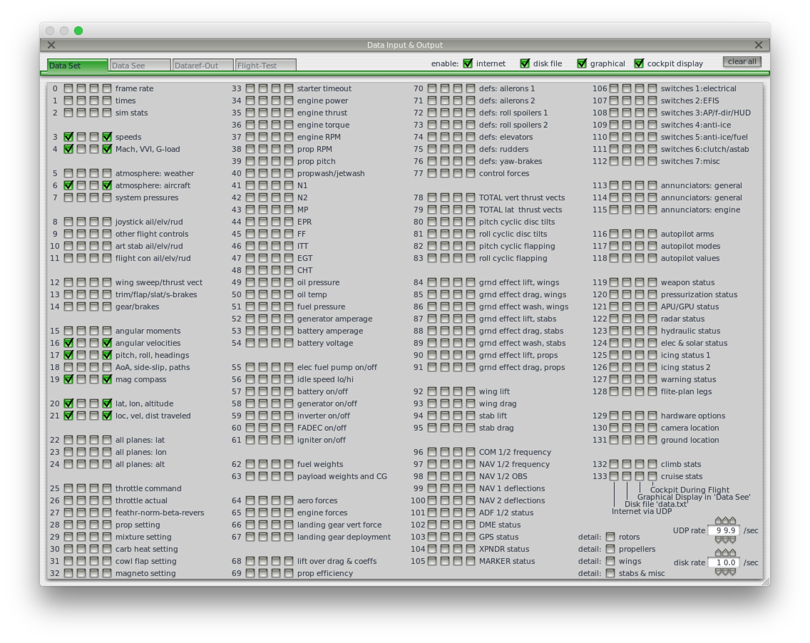
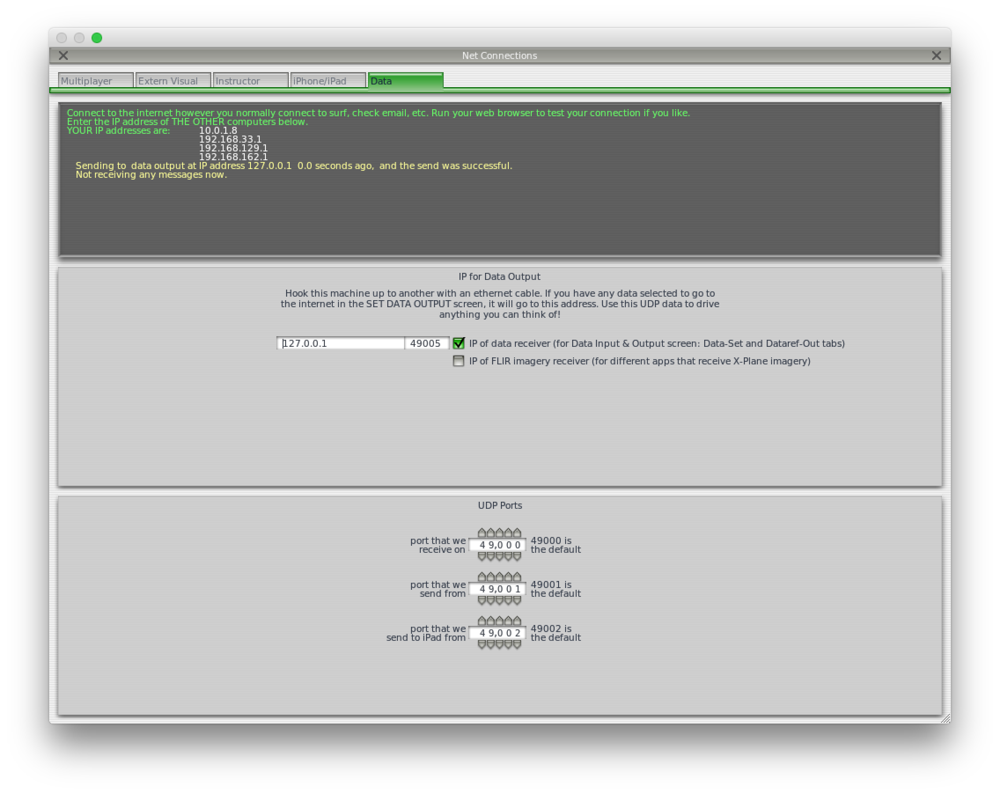
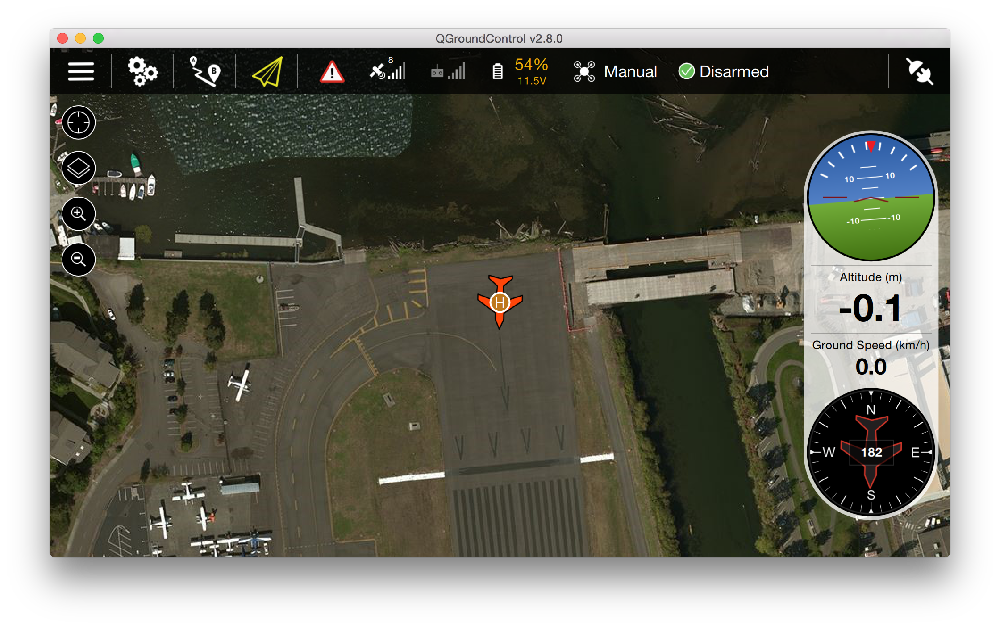
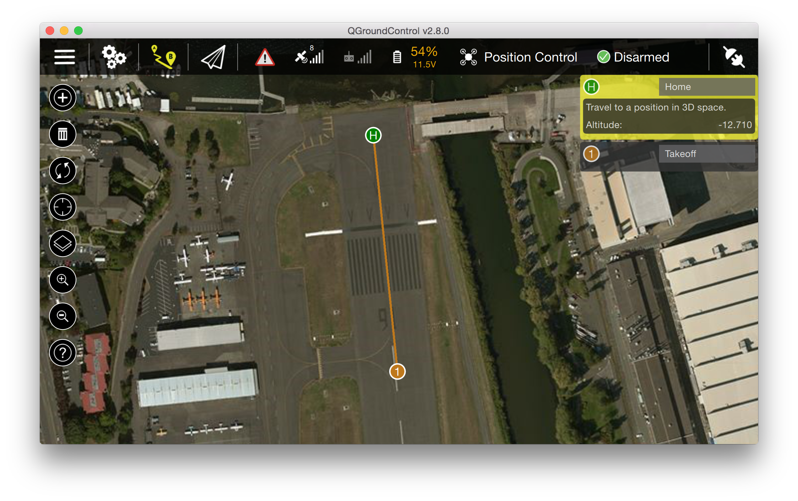

# HTIL（Hardware in the Loop Simulation）模拟

在HTIL模拟模式下，需要连接真正的自动驾驶仪到模拟器，所有的飞控代码都运行在自动驾驶仪硬件上。这种方法的优点是可以在真正的处理器上运行实际的飞控代码。

## 配置HITL系统

PX4 supports HITL for multicopters (using jMAVSim) and fixed wing (using X-Plane demo or full). Flightgear support is present as well, but we generally recommend X-Plane. To enable it, configure it via the airframe menu.



## 使用jMAVSim（四轴飞行器）

- 确保QGroundControl没有在运行，并且没有通过串口访问设备）
- 用HITL模式运行jMAVSim（如有必要，请将下面的串口替换为你的设置）：
  ```
  ./Tools/jmavsim_run.sh -q -d /dev/ttyACM0 -b 921600 -r 250
  ```
- 控制台会开始显示从自动驾驶仪传来的mavlink文本消息。
- 然后通过默认的UDP配置连接QGroundControl。

## 使用X-Plane
#### 在X-Plane中开启远程控制

在X-Plane中有两个关键的设置需要改：在`Settings`->`Data Input and Output`里，勾选如下单选框：



在`Settings`->`Net Connections`的`Data`标签页中，将localhost和49005分别设置为IP地址和端口号，如图：



## 在QGroundControl中启用HITL

打开`Widgets`->`HIL Config`，然后在下拉列表中选择`X-Plane 10`，再点`connect`。连接成功后，电池状态、GPS状态和飞机的位置信息应该都是可用的：



## 切换到摇杆输入

如果你希望使用摇杆而不是遥控器，请将参数`COM_RC_IN_MODE`设置为`1`。你可以在`Commander`参数组里找到它。

## 在HITL中执行自主任务

Switch to the flight planning view and put a single waypoint in front of the plane. Click on the sync icon to send the waypoint.

Then select MISSION from the flight mode menu in the toolbar and click on DISARMED to arm the plane. It will take off and loiter around the takeoff waypoint.


