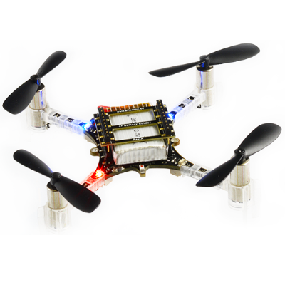

# Crazyflie 2.0

Crazyflie系列微型四轴由Bitcraze AB开发。你可以在[这里](https://www.bitcraze.io/crazyflie-2/)看到Crazyflie 2 (CF2)的介绍：

## 简介

> **主要的硬件文档在[这里](https://wiki.bitcraze.io/projects:crazyflie2:index)。**

  * Main System-on-Chip: STM32F405RG
    * CPU: 168 MHz ARM Cortex M4 with single-precision FPU
    * RAM: 192 KB SRAM
  * nRF51822射频和电源管理MCU
  * MPU9250加速剂/陀螺仪/磁罗盘
  * LPS25H气压计

## 烧写固件

在设置好PX4的开发环境之后，按照下面的步骤讲PX4软件烧写到CF2上：

1. 获取PX4的[Bootloader](https://github.com/PX4/Bootloader)

2. 使用`make crazyflie_bl`命令构建

3. 让CF2进入DFU模式：
	- 确保它处于关机状态
	- 按住向下键
	- 插入连接到计算机的USB线
	- 1秒之后，蓝色LED应该开始闪烁，5秒之后，应该会加速闪烁
	- 松开按键

4. 使用dfu-util烧写Bootloader：`sudo dfu-util -d 0483:df11 -a 0 -s 0x08000000 -D crazyflie_bl.bin`，完成后拔出USB线
	- 如果烧写成功，下次插入USB线的时候黄色LED应该会闪烁

5. 获取PX4的[固件](https://github.com/PX4/Firmware)
6. 使用`make crazyflie_default upload`命令构建并上传
7. 编译好后会提示你插入设备，此时插入CF2：黄色LED应该会开始闪烁，这表示CF2进入了bootloader模式。随后红色LED应该会亮起来，表示已经开始烧写过程。

8. 等待烧写完成

9. 搞定！请使用QGC来校准CF2

## 无线

注意：无线通信的驱动程序还在开发之中，尚不可用。

板载的nRF模块支持通过蓝牙或者专有的2.4GHz Nordic ESB协议通信。
- 推荐使用[Crazyradio PA](https://www.bitcraze.io/crazyradio-pa/)。
- 目前只支持用Crazyflie的手机app通过蓝牙连接控制CF2的飞行。

使用官方的Bitcraze **Crazyflie手机应用**

- 通过蓝牙连接
- 在设置里将模式从1修改为2
- 通过QGC校准

通过**MAVLink**连接

- 使用Crazyradio PA连接一个兼容的GCS
- See [cfbridge](https://github.com/dennisss/cfbridge) for how to connect any UDP capable GCS to the radio

## 飞行

https://www.youtube.com/watch?v=oWk0RRIzF-4
