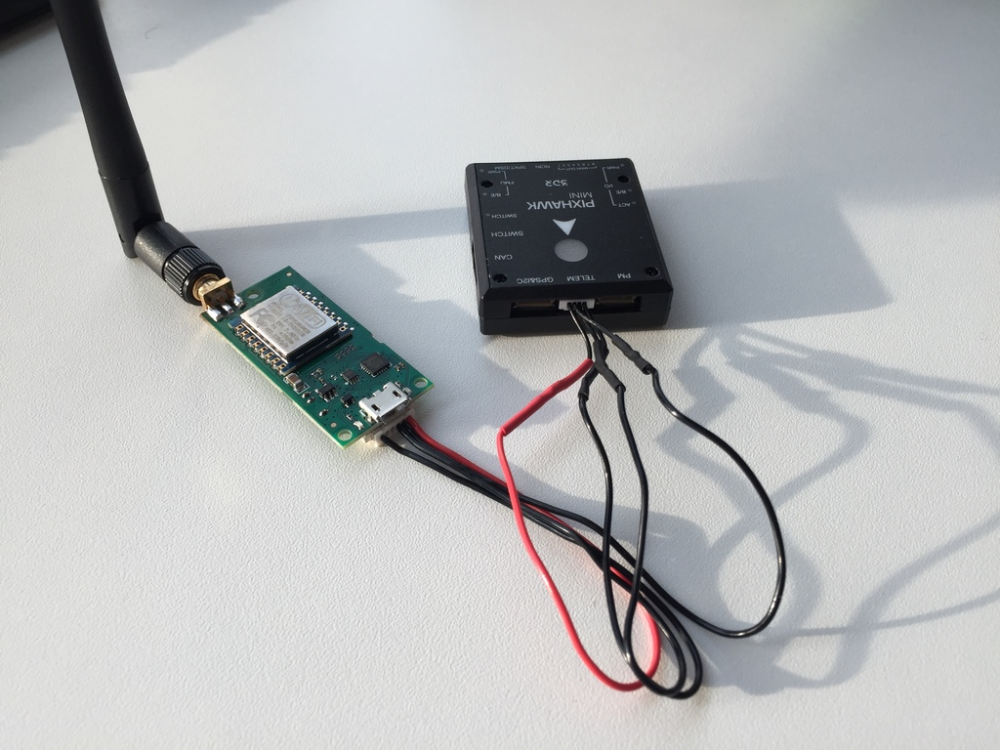
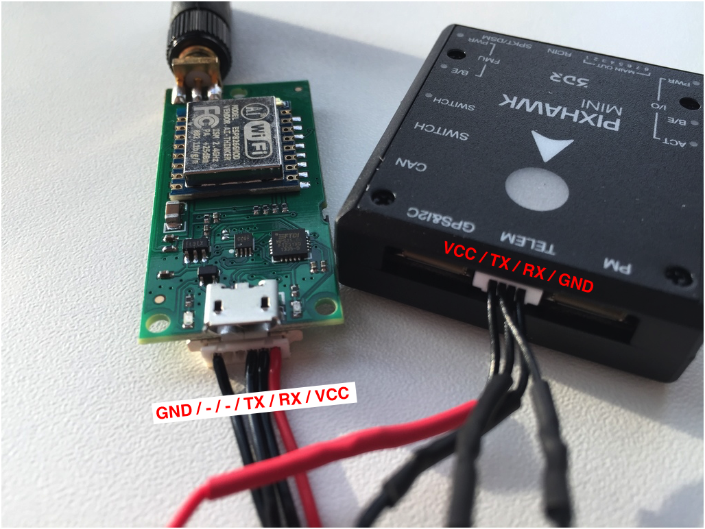

# 数传
可以用数传同QGroundControl通信，调试时用数传可以免去频繁插拔数据线的麻烦。

## 3DR WIFI数传

如果使用3DR的WIFI数传，你就只需要一个收发器（我们假设你的电脑/平板是支持WIFI的）。你只需要将WIFI数传模块连接到```TELEM```端口，然后将它作为一个WIFI接入点使用就行，ESSID和密码如下：

```sh
essid: APM_PIX
password: 12345678
```
连接成功后，QGroundControl应该会自动识别并连接到你的设备。



